train_images = x_train.reshape((60000, 784))
test_images = x_test.reshape((10000, 784))

```
ACTIVATION_FUNCTION_HIDDEN_1 = 'sigmoid'
ACTIVATION_FUNCTION_HIDDEN_2 = 'relu'
ACTIVATION_FUNCTION_OUTPUT = 'softmax'

model = models.Sequential([
    # 0 INPUT LAYER (primera capa -izq-)
    keras.Input(shape=(784,)),


    # 1 hidden layer (capa oculta)
    #        q tantas neuronas, que tipo de activacion,
    keras.layers.Dense(512, activation=ACTIVATION_FUNCTION_HIDDEN_1),

    # 2 hidden layer (capa oculta)
    keras.layers.Dense(128, activation=ACTIVATION_FUNCTION_HIDDEN_2),


    # 3 output layer (capa de salida)
    keras.layers.Dense(10, activation=ACTIVATION_FUNCTION_OUTPUT),
])
```

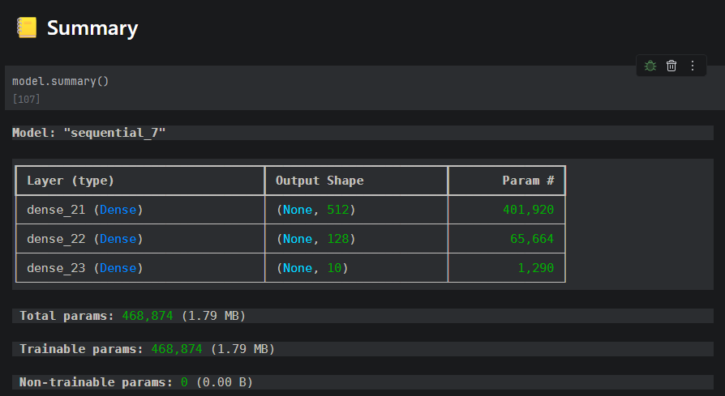

optimizer = keras.optimizers.Adam(learning_rate=0.001)
model.compile(loss = "categorical_crossentropy", optimizer=optimizer, metrics=['accuracy'])

version = model.fit(train_images, train_labels, epochs=15, shuffle=True, validation_split=0.2)

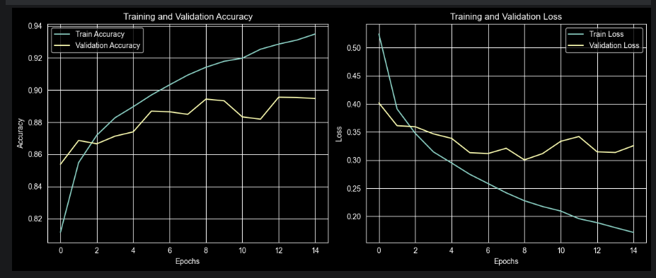

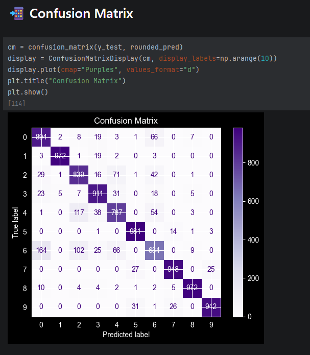

Accuracy: 0.8880000114440918

-----------------------------------------------

# Second Round

------------------------------------------------

## 🔀 Train/Test Split

##### Normalizar
x_train = x_train.astype("float32") / 255.0
x_test = x_test.astype("float32") / 255.0

##### Agregar dimensión del canal
x_train = x_train.reshape(-1, 28, 28, 1)
x_test = x_test.reshape(-1, 28, 28, 1)

## 🧠 Create Modell
```
ACTIVATION_FUNCTION_HIDDEN_2 = 'relu'
ACTIVATION_FUNCTION_OUTPUT = 'softmax'

model = models.Sequential([
    # 0 INPUT LAYER (primera capa -izq-)
    keras.Input(shape=(28, 28, 1)),


    # 1 hidde LAYER
    layers.Conv2D(32, kernel_size=(3, 3), strides=(1,1), activation=ACTIVATION_FUNCTION_HIDDEN_2,
    padding="same"), # Conv2D por que son fotos->2D                             # 28*28*32

    layers.MaxPooling2D(pool_size=(2, 2),  strides=(2,2)),                      # 14*14*32

    # -------------------------------------------------------------
    # 2 hidde LAYER
    layers.Conv2D(64, kernel_size=(3, 3), strides=(1,1), activation=ACTIVATION_FUNCTION_HIDDEN_2,
    padding="same"), # Conv2D por que son fotos->2D                             # 14*14*64

    layers.MaxPooling2D(pool_size=(2, 2),  strides=(2,2)),

    # Flatten the output of conv2D
    layers.Flatten(),

    # envia en Feature map al la RED-Nnal
    layers.Dense(128, activation=ACTIVATION_FUNCTION_HIDDEN_2),

    # 3 output layer (capa de salida)
    layers.Dense(10, activation=ACTIVATION_FUNCTION_OUTPUT),
])
```

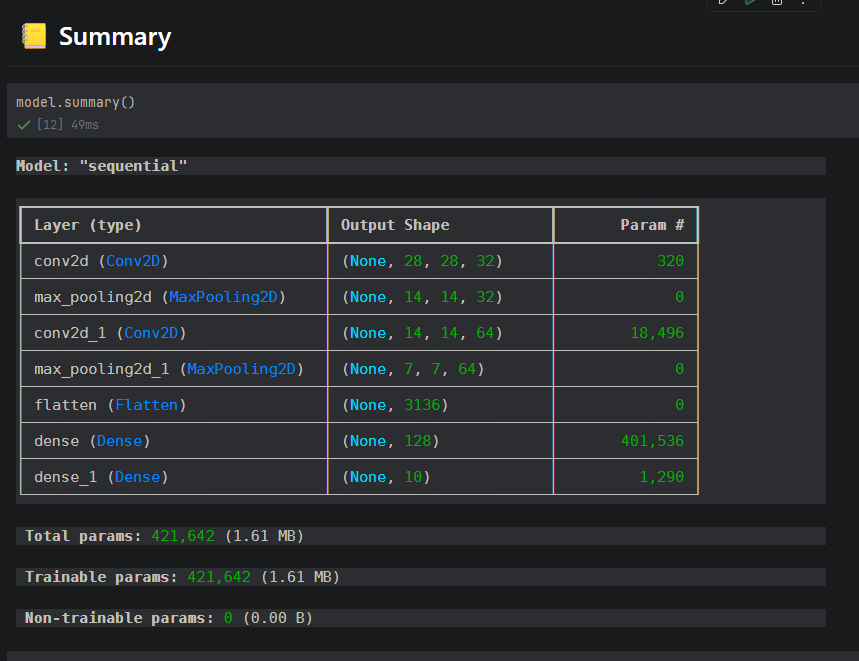


model.compile(loss = "categorical_crossentropy", optimizer="adam", metrics=['accuracy'])

version = model.fit(x_train, y_train, epochs=10, shuffle=True, validation_split=0.2)

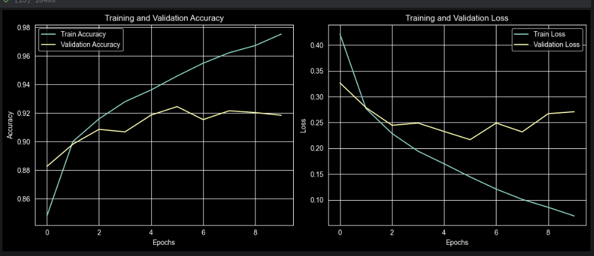

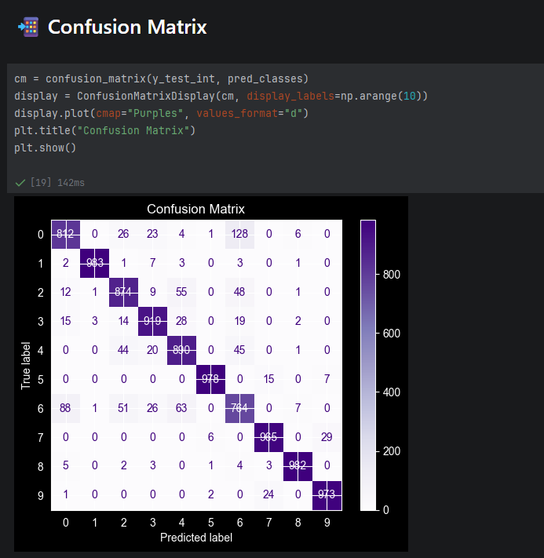

*-**-**-**-**-**-**-**-**-**-*
Accuracy: 0.9139999747276306
*-**-**-**-**-**-**-**-**-**-*


-----------------------------------------------

# Third Round

------------------------------------------------
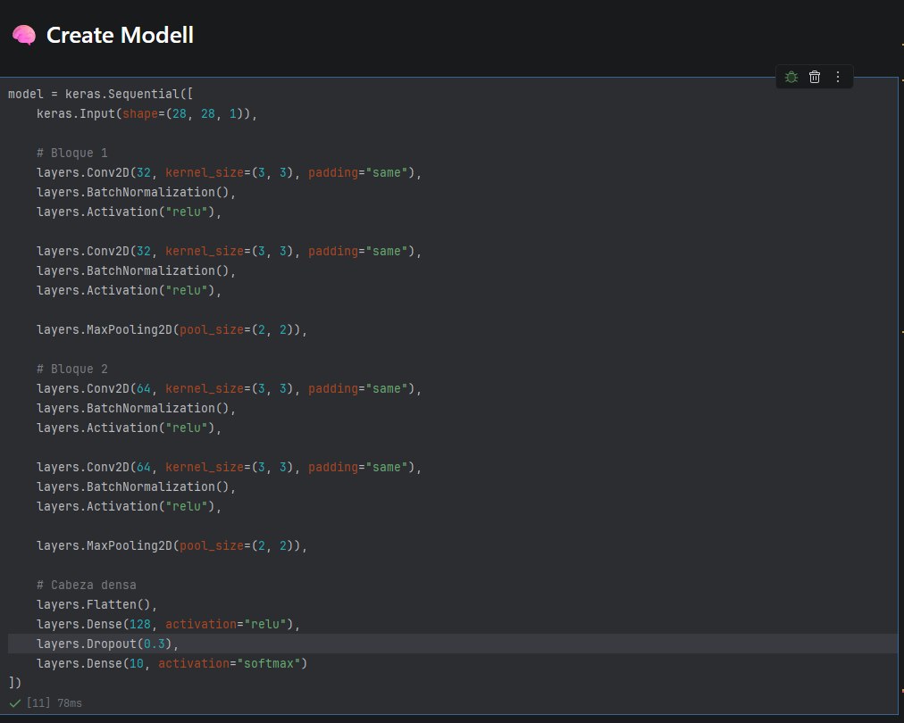

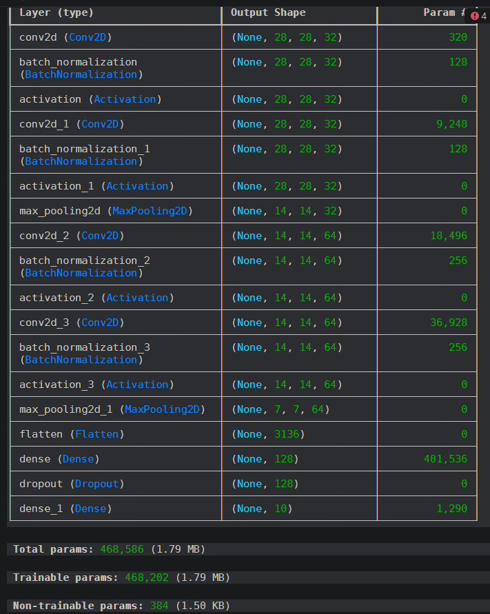

version = model.fit(x_train, y_train, epochs=25, shuffle=True, validation_split=0.2)

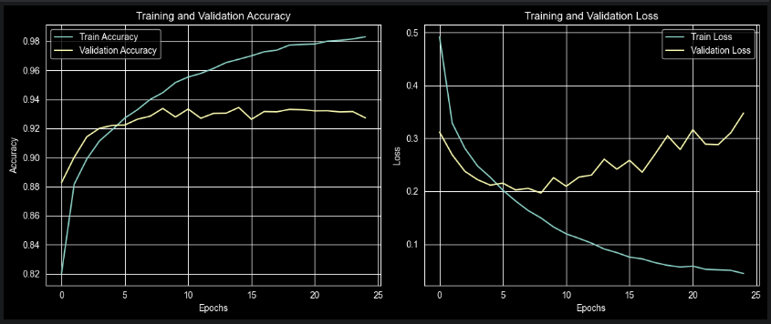

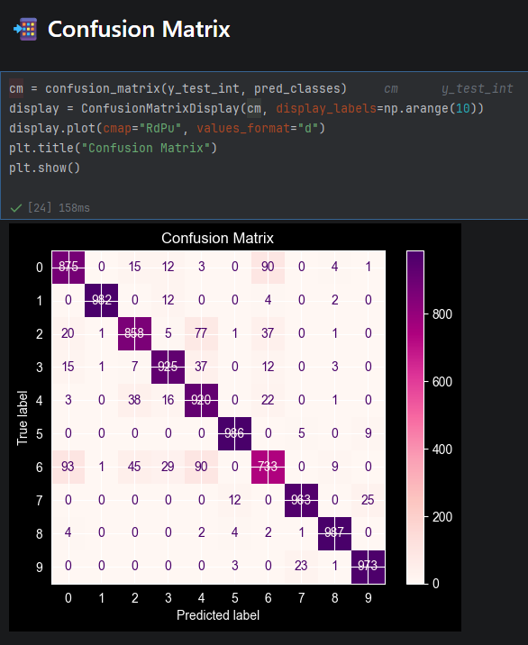

*-**-**-**-**-**-**-**-**-**-*
Accuracy: 0.920199990272522
*-**-**-**-**-**-**-**-**-**-*


-----------------------------------------------

# Last Round

------------------------------------------------
```
model = keras.Sequential([
    keras.Input(shape=(28, 28, 1)),
    
    
    # Bloque 1
    layers.Conv2D(32, kernel_size=(3, 3), padding="same"),
    layers.BatchNormalization(),
    layers.Activation("relu"),

    layers.Conv2D(32, kernel_size=(3, 3), padding="same"),
    layers.BatchNormalization(),
    layers.Activation("relu"),

    layers.MaxPooling2D(pool_size=(2, 2)),

    # Bloque 2
    layers.Conv2D(64, kernel_size=(3, 3), padding="same"),
    layers.BatchNormalization(),
    layers.Activation("relu"),

    layers.Conv2D(64, kernel_size=(3, 3), padding="same"),
    layers.BatchNormalization(),
    layers.Activation("relu"),

    layers.MaxPooling2D(pool_size=(2, 2)),
    
    # Bloque 3
    layers.Conv2D(128, kernel_size=(3, 3), padding="same"),
    layers.BatchNormalization(),
    layers.Activation("relu"),

    layers.Conv2D(128, kernel_size=(3, 3), padding="same"),
    layers.BatchNormalization(),
    layers.Activation("relu"),

    layers.MaxPooling2D(pool_size=(2, 2)),

    # Cabeza densa
    layers.Flatten(),
    layers.Dense(128, activation="relu"),
    layers.Dropout(0.3),
    layers.Dense(10, activation="softmax")
])
```
```
┏━━━━━━━━━━━━━━━━━━━━━━━━━━━━━━━━━┳━━━━━━━━━━━━━━━━━━━━━━━━┳━━━━━━━━━━━━━━━┓
┃ Layer (type)                    ┃ Output Shape           ┃       Param # ┃
┡━━━━━━━━━━━━━━━━━━━━━━━━━━━━━━━━━╇━━━━━━━━━━━━━━━━━━━━━━━━╇━━━━━━━━━━━━━━━┩
│ random_rotation                 │ (None, 28, 28, 1)      │             0 │
│ (RandomRotation)                │                        │               │
├─────────────────────────────────┼────────────────────────┼───────────────┤
│ random_zoom (RandomZoom)        │ (None, 28, 28, 1)      │             0 │
├─────────────────────────────────┼────────────────────────┼───────────────┤
│ conv2d (Conv2D)                 │ (None, 28, 28, 32)     │           320 │
├─────────────────────────────────┼────────────────────────┼───────────────┤
│ batch_normalization             │ (None, 28, 28, 32)     │           128 │
│ (BatchNormalization)            │                        │               │
├─────────────────────────────────┼────────────────────────┼───────────────┤
│ activation (Activation)         │ (None, 28, 28, 32)     │             0 │
├─────────────────────────────────┼────────────────────────┼───────────────┤
│ conv2d_1 (Conv2D)               │ (None, 28, 28, 32)     │         9,248 │
├─────────────────────────────────┼────────────────────────┼───────────────┤
│ batch_normalization_1           │ (None, 28, 28, 32)     │           128 │
│ (BatchNormalization)            │                        │               │
├─────────────────────────────────┼────────────────────────┼───────────────┤
│ activation_1 (Activation)       │ (None, 28, 28, 32)     │             0 │
├─────────────────────────────────┼────────────────────────┼───────────────┤
│ max_pooling2d (MaxPooling2D)    │ (None, 14, 14, 32)     │             0 │
├─────────────────────────────────┼────────────────────────┼───────────────┤
│ conv2d_2 (Conv2D)               │ (None, 14, 14, 64)     │        18,496 │
├─────────────────────────────────┼────────────────────────┼───────────────┤
│ batch_normalization_2           │ (None, 14, 14, 64)     │           256 │
│ (BatchNormalization)            │                        │               │
├─────────────────────────────────┼────────────────────────┼───────────────┤
│ activation_2 (Activation)       │ (None, 14, 14, 64)     │             0 │
├─────────────────────────────────┼────────────────────────┼───────────────┤
│ conv2d_3 (Conv2D)               │ (None, 14, 14, 64)     │        36,928 │
├─────────────────────────────────┼────────────────────────┼───────────────┤
│ batch_normalization_3           │ (None, 14, 14, 64)     │           256 │
│ (BatchNormalization)            │                        │               │
├─────────────────────────────────┼────────────────────────┼───────────────┤
│ activation_3 (Activation)       │ (None, 14, 14, 64)     │             0 │
├─────────────────────────────────┼────────────────────────┼───────────────┤
│ max_pooling2d_1 (MaxPooling2D)  │ (None, 7, 7, 64)       │             0 │
├─────────────────────────────────┼────────────────────────┼───────────────┤
│ conv2d_4 (Conv2D)               │ (None, 7, 7, 128)      │        73,856 │
├─────────────────────────────────┼────────────────────────┼───────────────┤
│ batch_normalization_4           │ (None, 7, 7, 128)      │           512 │
│ (BatchNormalization)            │                        │               │
├─────────────────────────────────┼────────────────────────┼───────────────┤
│ activation_4 (Activation)       │ (None, 7, 7, 128)      │             0 │
├─────────────────────────────────┼────────────────────────┼───────────────┤
│ conv2d_5 (Conv2D)               │ (None, 7, 7, 128)      │       147,584 │
├─────────────────────────────────┼────────────────────────┼───────────────┤
│ batch_normalization_5           │ (None, 7, 7, 128)      │           512 │
│ (BatchNormalization)            │                        │               │
├─────────────────────────────────┼────────────────────────┼───────────────┤
│ activation_5 (Activation)       │ (None, 7, 7, 128)      │             0 │
├─────────────────────────────────┼────────────────────────┼───────────────┤
│ max_pooling2d_2 (MaxPooling2D)  │ (None, 3, 3, 128)      │             0 │
├─────────────────────────────────┼────────────────────────┼───────────────┤
│ flatten (Flatten)               │ (None, 1152)           │             0 │
├─────────────────────────────────┼────────────────────────┼───────────────┤
│ dense (Dense)                   │ (None, 128)            │       147,584 │
├─────────────────────────────────┼────────────────────────┼───────────────┤
│ dropout (Dropout)               │ (None, 128)            │             0 │
├─────────────────────────────────┼────────────────────────┼───────────────┤
│ dense_1 (Dense)                 │ (None, 10)             │         1,290 │
└─────────────────────────────────┴────────────────────────┴───────────────┘
 Total params: 437,098 (1.67 MB)
 Trainable params: 436,202 (1.66 MB)
 Non-trainable params: 896 (3.50 KB)
```

optimizer = keras.optimizers.Adam(learning_rate=0.0005)
model.compile(loss = "categorical_crossentropy", optimizer="adam", metrics=['accuracy'])

version = model.fit(x_train, y_train, epochs=25, shuffle=True, validation_split=0.2)

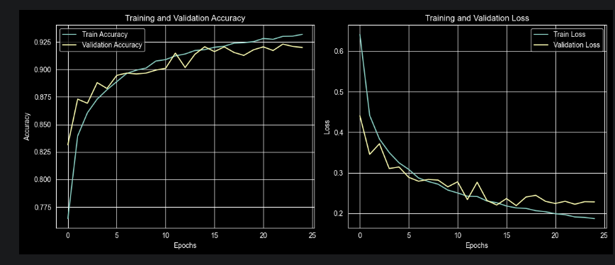

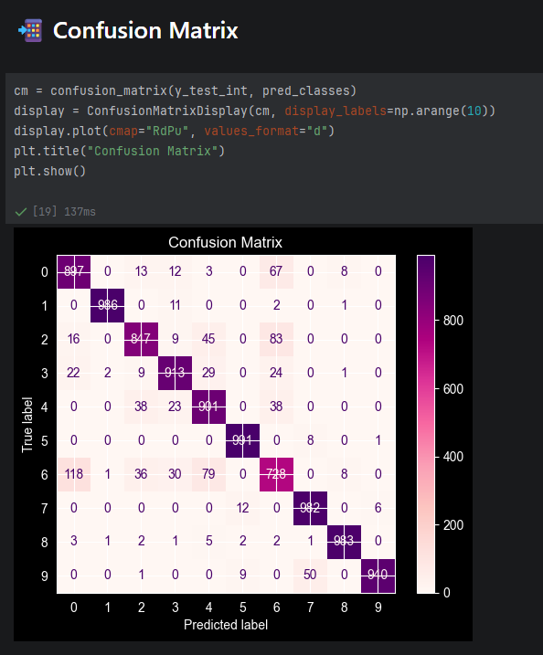

*-**-**-**-**-**-**-**-**-**-*
Accuracy: 0.9168000221252441
*-**-**-**-**-**-**-**-**-**-*